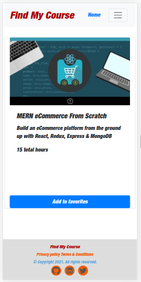

# Final Capstone Project: Find My Course



> In this final capstone project, I built a website where users can browse a list of courses. The app makes an external API request to retrieve a list of courses from the server. The retrived API data is stored in the ```redux store``` and served the user on demand. Authenticated users can add any selected course to their favorites. The favorites list is always retrieved from the server on browser load, and stored in the ```redux store```. Users can view their list of favourite courses from a link provided. They can also remove any existing favourite course. 

> ```React-Redux Hooks``` was used to fetch the requested data from the ```redux store```. 

> ```axios```, a client HTTP API  was used to make external API calls.

> ```redux-thunk``` middleware was used to allow an ```async action creator``` function to be returned on ```action dispatch```, instead of the action itself.

> The app was successfully tested and deployed on heroku.

### Languages, Frameworks, Metthods

- JavaScript
- ReactJS
- React-Redux
- React-Redux Hooks
- Bootstrap


## 📝 Setup

 - Open a terminal
 
 - Clone this app: 
        ```
        git clone https://github.com/ezeilo-su/find-my-course-react-app.git
        ```

- ```cd``` into the app directory.

- Run the command ```npm install``` to install the required dependencies.

- In the project directory, run:

#### `npm start`

Runs the app in the development mode.\
Open [http://localhost:3000](http://localhost:3000) to view it in the browser.


### Check out live demo [here](https://findmycourse.herokuapp.com/)


## Author

👤 **Sunday Uche Ezeilo**

- Github: [@sundayezeilo](https://github.com/ezeilo-su)
- Twitter: [@SundayEzeilo](https://twitter.com/SundayEzeilo)
- Linkedin: [Sunday Ezeilo](https://www.linkedin.com/in/sundayezeilo/)


## 🤝 Contributing

- Contributions, issues, and feature requests are welcome!

- Feel free to check the [issues page](https://github.com/ezeilo-su/find-my-course-react-app/issues).

## Show your support

Give a ⭐️ if you like this project!


## Acknowledgments

- Microverse
- @ebukaume
- etc

## Credit
- Design idea by [Alexey Savitskiy on Behance](https://www.behance.net/alexey_savitskiy).

## 📝 License

This project is provided with MIT license.